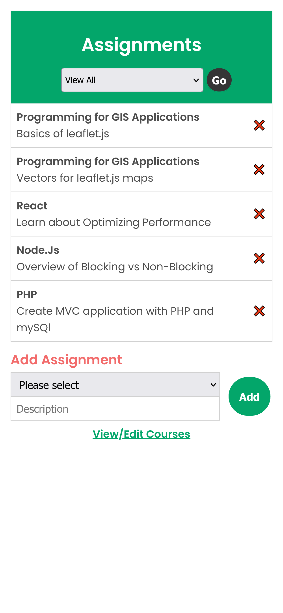

# Assignment Tracker

Track your courses and assignments with this MVC application built with PHP, mySQL and SASS.

<h3>Technologies:</h3>
 <ul>
    <li>PHP</li>
    <li>mySQL</li>
    <li>SASS</li>
 </ul>

## Preview:

Features:

- Create/Delete courses.
- Add/Remove different assignments for each course categories you have created.
- Data fetched from mySQL database.

Learned:

- How to build a relational database with mySQL.
- The Model-View-Controller / MVC.
- Create the Database Connection with PDO.
- PHP and mySQL Fundamentals
- How to use the XAMPP server for Windows OS and LAMP stack for Linux.
- Learned how to create a development branch in order to clone and push repository from Windows OS instead of Linux.
